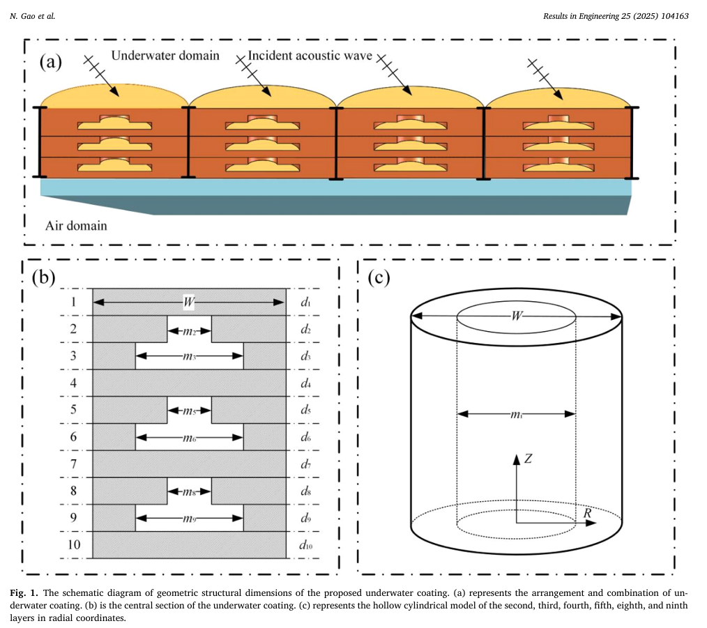
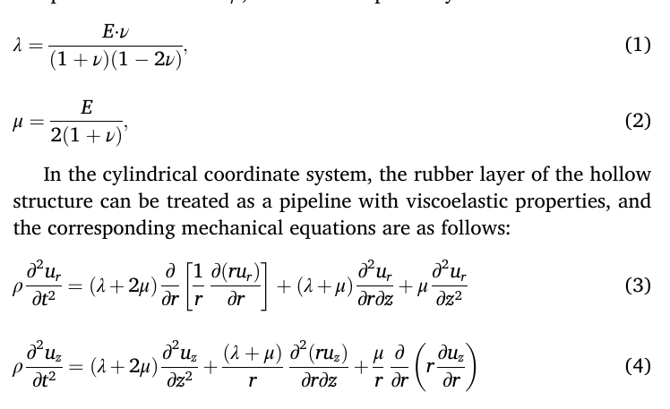
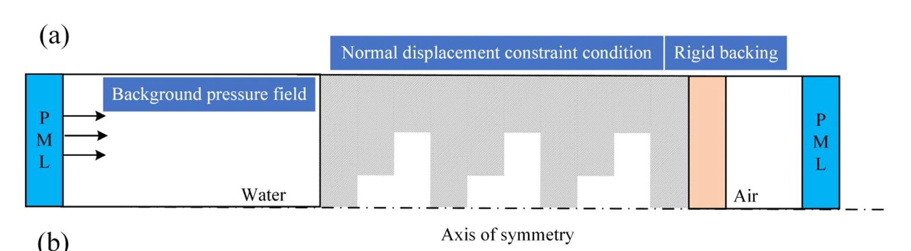
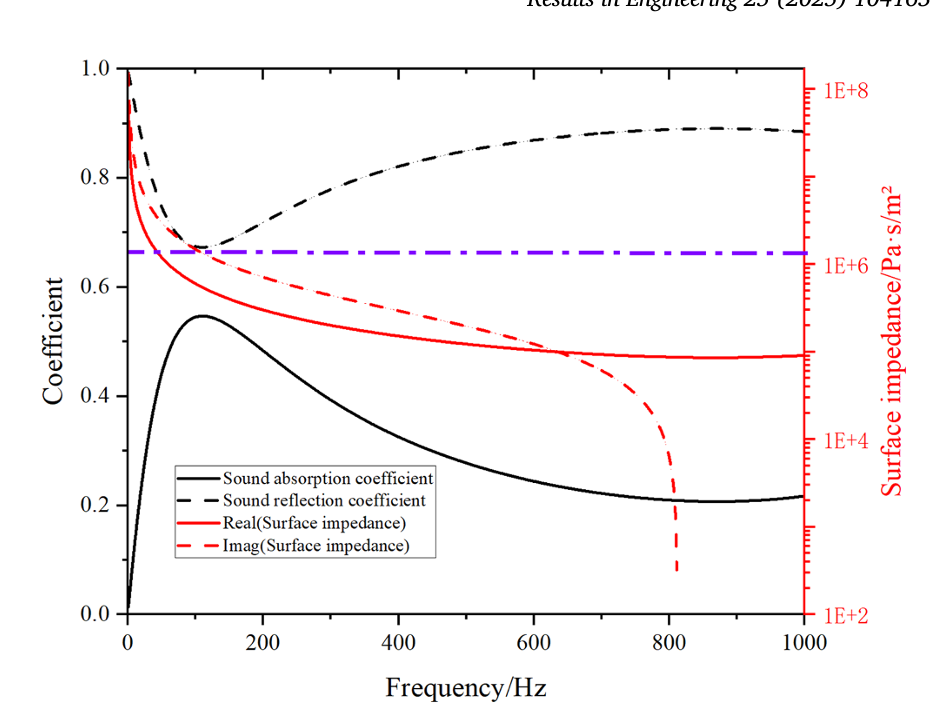
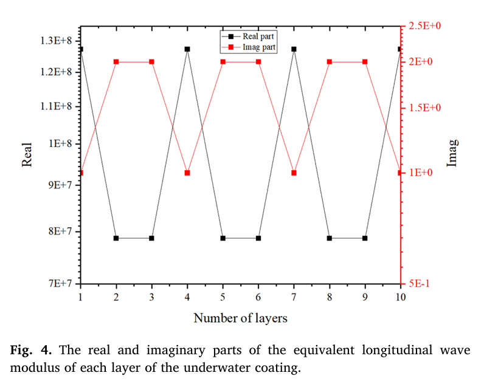
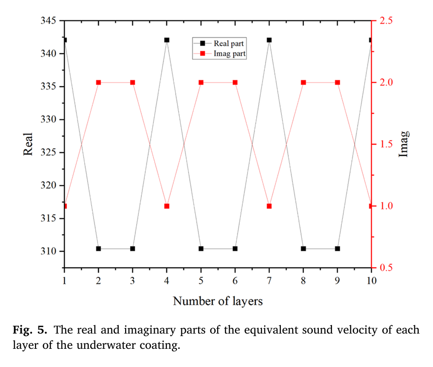
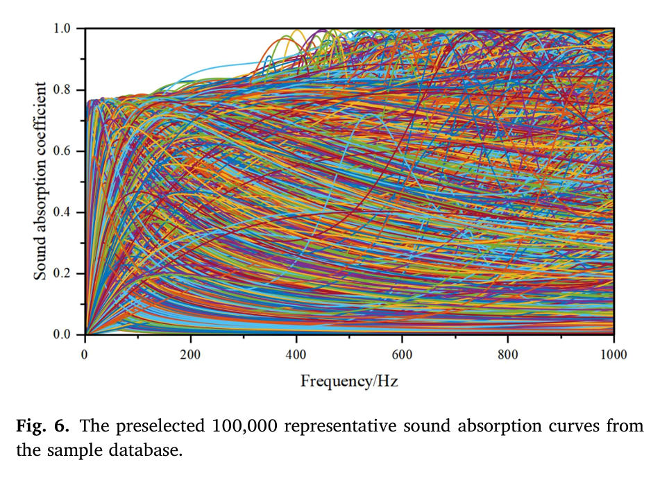
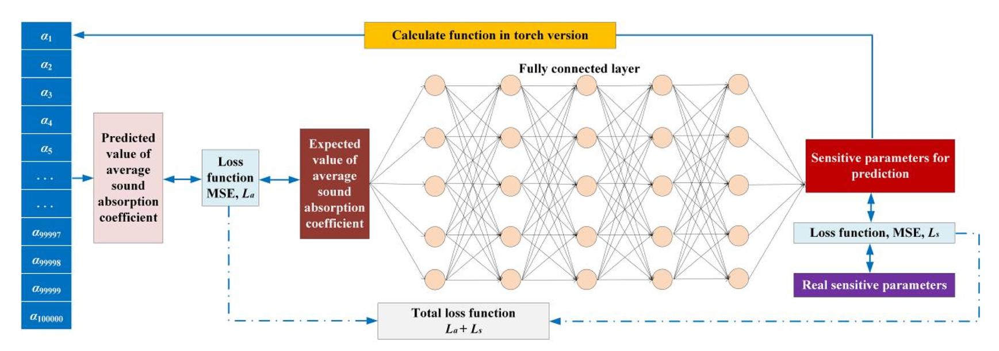
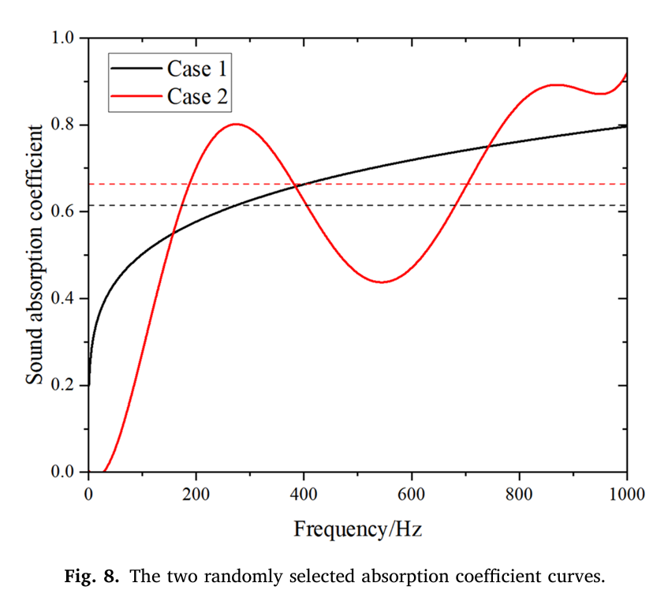
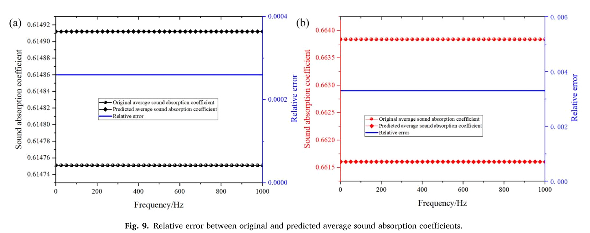

# Paper Reference: On-demand Prediction of Low-Frequency Average Sound Absorption Coefficient of Underwater Coating Using Machine Learning

> **Full Citation:** Gao, N., Wang, M., Liang, X., & Pan, G. — *Ocean Engineering*

---

## Metadata

| Field | Details |
|-------|---------|
| **Authors** | Nansha Gao (a,*), Mou Wang (b), Xiao Liang (c), Guang Pan (a) |
| **Affiliation (a)** | Key Laboratory of Unmanned Underwater Vehicle, School of Marine Science and Technology, Northwestern Polytechnical University, Xi'an 710072, China |
| **Affiliation (b)** | Institute of Acoustics, Chinese Academy of Sciences, Beijing 100190, China |
| **Affiliation (c)** | Xiangtan University, School of Mechanical Engineering and Mechanics, Xiangtan 411105, China |
| **Keywords** | Underwater sound absorption, Transfer-matrix method, Machine learning, Deep neural network, On-demand prediction |
| **Funding** | National Natural Science Foundation of China (Grant Nos. 11704314 and 52171323), China Postdoctoral Science Foundation (Grant No. 2018M631194) |

---

## Abstract — Key Points

- Proposes an underwater coating with sound absorption ability in the **middle-to-low frequency range**.
- Establishes an acoustic theoretical model combining **equivalent medium theory** and **transfer matrix method (TMM)**.
- Calculates: sound absorption coefficient, surface characteristic impedance, equivalent volume longitudinal wave modulus, and equivalent sound velocity.
- Uses **20 sensitive parameters** and **Latin Hypercube Sampling (LHS)** to generate **100,000 random sound absorption coefficient curves** in **1 Hz – 1,000 Hz**.
- Employs **deep neural networks (DNNs)** to predict the average value of the sound absorption coefficient curve.
- The overall loss function combines: (1) MSE between expected and predicted average absorption coefficient, and (2) the network-optimized loss function.
- Verification with two test curves shows errors of only **0.026%** and **0.33%** between expected and predicted average absorption coefficients.

---

## Section 1: Introduction

### Context & Motivation

- The field of acoustic metamaterials has been exploring how to apply **artificial intelligence to design acoustic structures and materials on demand**.
- Machine learning is the mainstream method for solving AI-related problems in this domain.
- The key challenge: developing AI-based algorithms that enable machines to **learn from sample databases** and improve abilities of metamaterials to control sound waves.
- Traditional design process limitations: theoretical calculations and finite element methods have the constraint that "a structure defines the performance" — involving numerous trials, high error and labor costs, and significant time and computational resources.

### Categories of ML Methods for Acoustic Material Design

1. **Supervised Learning / Support Vector Machines (SVM):** Used for classification of acoustic properties and predicting impact of structural parameters on performance [15].
2. **Unsupervised Learning / Principal Component Analysis (PCA):** Reduces data dimensionality while preserving original data; identifies key factors affecting material properties for design optimization [16-18].
3. **Reinforcement Learning (RL):** Suitable for multi-objective optimization and high-dimensional parameter space problems. Balances objectives of acoustic transmission, isolation, and focusing performance [19-22].
4. **Deep Learning (DL):** A branch of ML applicable to all three learning types. Deep neural networks (DNNs) approximate value functions and optimize strategies. Learns complex feature representations and abstract concepts [23-30].
5. **Convolutional Neural Networks (CNNs):** Advantages in processing grid-structured data through convolutional layers, pooling layers, and local connections [31-34].

### Key Prior Work Highlighted

- CNN-based prediction for ultra-thin metasurface acoustic absorber — reduces characterization time while maintaining accuracy [35].
- DL-based broadband acoustic metamaterials — average absorption coefficient higher than 97% in 860 Hz to 8000 Hz [7].
- DNN-based inverse prediction for low-frequency Helmholtz resonators [36].
- Improved Gaussian-Bayesian model for subwavelength absorbers at < 500 Hz [37].
- Deep autoencoder (DAE) model for predicting absorption peak points [30].

### Underwater-Specific Challenges

- Underwater impedance mismatch and pressure resistance limitations make improving sound absorption challenging.
- High production and experimental costs require accurate acoustic property estimation before preparing samples.
- Key factor: predicting structural and material parameters corresponding to expected average sound absorption coefficient within a specific frequency band.
- Prior work: introducing prior knowledge into data-driven optimization reduced average acoustic transmission loss by 31.78% vs. traditional impedance gradient design [38].
- ML + optimization + FEM achieved prediction speed increase of **4500 times** for absorption coefficients [39].

### Present Study Approach

1. Proposes a theoretical calculation method for underwater coating with embedded multi-layer cavities.
2. Uses 100,000 absorption curves as sample database.
3. Predicts 20 sensitive parameters from a randomly selected average absorption coefficient (target: 1 Hz – 1000 Hz).
4. Shows predicted average absorption coefficient has very small error vs. original.

### Paper Structure

- **Section 2:** Structure, materials, calculation methods for acoustic properties, and the 100,000 sample database.
- **Section 3:** Deep learning-based framework and method.
- **Section 4:** Prediction results and error verification for two test absorption curves.
- **Section 5:** Conclusions.

---

## Section 2: Acoustic Theoretical Models and Databases

### 2.1 Underwater Coating Structure

*Fig. 1: (a) Periodic array combination, (b) Proposed underwater coating with rigid boundaries between units, (c) Hollow circular tube mechanical model.*

**Structure description:**
- Periodic array combination of units with **rigid boundaries** between them.
- **Rigid backing** at the bottom for complete reflection conditions.
- Incident sound waves in water enter from **top to bottom**.
- Each unit is divided into **10 layers**.
- Layers 2, 3, 5, 6, 8, and 9 are **hollow structures**.
- Substrate material: **rubber**.

#### Table 1: Specific Structural Sizes (in mm)

| W | d1 | d2 | d3 | d4 | d5 | d6 | d7 | d8 | d9 | d10 |
|---|----|----|----|----|----|----|----|----|----|----|
| 2000 | 10 | 10 | 10 | 10 | 10 | 10 | 10 | 10 | 10 | 10 |

| m2 | m3 | m5 | m6 | m8 | m9 |
|----|----|----|----|----|-----|
| 1000 | 1000 | 1000 | 1000 | 1000 | 1000 |

#### Table 2: Mechanical Parameters of the Units

| Parameter | Symbol | Value |
|-----------|--------|-------|
| Density | ρ | 1130 kg/m³ |
| Young's modulus | E | 5×10⁷(1+ηi) Pa |
| Loss factor | η | 0.4 |
| Poisson's ratio | ν | 0.44 |

### 2.2 Equivalent Medium Theory

The six layers of hollow structures are treated as **uniform rubber layers with equivalent parameters**. Each hollow structure layer is modeled as a **hollow circular tube**.

The dynamic elastic modulus in rubber is expressed using the **Lamé constant λ** and **complex shear modulus μ**:

$$\lambda = \frac{E \cdot \nu}{(1+\nu)(1-2\nu)} \tag{1}$$

$$\mu = \frac{E}{2(1+\nu)} \tag{2}$$

### 2.3 Mechanical Equations (Cylindrical Coordinates)

The rubber layer of the hollow structure is treated as a **pipeline with viscoelastic properties**:

$$\rho \frac{\partial^2 u_r}{\partial t^2} = (\lambda + 2\mu) \frac{\partial}{\partial r}\left[\frac{1}{r} \frac{\partial(r u_r)}{\partial r}\right] + (\lambda + \mu) \frac{\partial^2 u_r}{\partial r \partial z} + \mu \frac{\partial^2 u_r}{\partial z^2} \tag{3}$$

$$\rho \frac{\partial^2 u_z}{\partial t^2} = (\lambda + 2\mu) \frac{\partial^2 u_z}{\partial z^2} + \frac{(\lambda + \mu)}{r} \frac{\partial^2(r u_z)}{\partial r \partial z} + \frac{\mu}{r} \frac{\partial}{\partial r}\left(r \frac{\partial u_z}{\partial r}\right) \tag{4}$$

Where $u_r$ and $u_z$ are the vibration displacements along the R and Z directions, respectively.

### 2.4 Boundary Conditions

- **Hollow part interface** at radius $r = m_i/2$ (i = 2, 3, 5, 6, 8, 9): free surface → normal stress $\sigma_{rz}$ and shear stress $\tau_{rz}$ both equal zero.
- **Outer boundary** at $r = w/2$: stationary → $u_r$ and shear stress $\tau_{rz}$ are both zero.

Normal stress and shear stress in cylindrical coordinates:

$$\sigma_{rz} = \lambda\left[\frac{\partial(ru_r)}{r \partial r} + \frac{\partial u_z}{\partial z}\right]$$

$$\tau_{rz} = \mu\left[\frac{\partial u_z}{\partial r} + \frac{\partial u_r}{\partial z}\right]$$

### 2.5 Harmonic Plane Wave Propagation

Harmonic plane waves propagate through the underwater coating along the Z-direction:

$$u = A e^{j(\omega t - k'z)} \tag{7}$$

Where $k'$ is the equivalent complex wave number, including longitudinal wave number $k_l$ and shear wave number $k_\tau$:

$$k_l = \sqrt{\frac{\rho \omega^2}{\lambda + 2\mu}}, \quad k_\tau = \sqrt{\frac{\rho \omega^2}{\mu}} \tag{8}$$

### 2.6 Solutions for Displacement Components

By substituting Eq. (7) into Eq. (4), the solutions for $u_z$ and $u_r$ with undetermined coefficients C₁–C₄ are:

$$u_z = C_1 J_0\left(r\sqrt{k_l^2 - k'^2}\right) + C_2 N_0\left(r\sqrt{k_l^2 - k'^2}\right) + C_3 J_0\left(r\sqrt{k_\tau^2 - k'^2}\right) + C_4 N_0\left(r\sqrt{k_\tau^2 - k'^2}\right) \tag{9}$$

$$u_r = \frac{-jC_1\sqrt{k_l^2 - k'^2}}{k'} J_1\left(r\sqrt{k_l^2 - k'^2}\right) - \frac{jC_2\sqrt{k_l^2 - k'^2}}{k'} N_1\left(r\sqrt{k_l^2 - k'^2}\right) + \frac{jC_3 k'}{{\sqrt{k_\tau^2 - k'^2}}} J_1\left(r\sqrt{k_\tau^2 - k'^2}\right) + \frac{jC_4 k'}{{\sqrt{k_\tau^2 - k'^2}}} N_1\left(r\sqrt{k_\tau^2 - k'^2}\right) \tag{10}$$

Where $J_0$, $J_1$ are Bessel functions of the first kind, and $N_0$, $N_1$ are Bessel functions of the second kind (Neumann functions).

### 2.7 Equivalent Parameters

Defining **perforation rate** $\varepsilon = m_i/w$ for a layer, the equivalent parameters are:

**Volume longitudinal wave modulus:**
$$S' = \frac{\mu(\lambda + 2\mu)(\varepsilon^2 + 1) + 2\varepsilon^2 \lambda}{(\lambda + \mu)\varepsilon^2 + \mu} \tag{9a}$$

**Equivalent density:**
$$\rho' = \rho(1 - \varepsilon^2) \tag{10a}$$

**Equivalent complex sound velocity:**
$$c' = \sqrt{\frac{S'}{\rho'}} \tag{11}$$

### 2.8 Transfer Matrix Method (TMM)

The transfer matrix $[T_i]$ of the i-th layer:

$$[T_i] = \begin{bmatrix} \cos(k'_i d_i) & j\rho'c'_i \sin(k'_i d_i) \\ \frac{j\sin(k'_i d_i)}{\rho'c'} & \cos(k'_i d_i) \end{bmatrix}, \quad i = 1, 2, \ldots, 10 \tag{12}$$

The total matrix considering equivalent sound pressure continuity and equivalent volume velocity continuity between layers, with perpendicular incidence:

$$[T] = [T_1][T_2][T_3] \cdots [T_{10}], \quad i = 1, 2, \ldots, 10 \tag{13}$$

### 2.9 Reflection Coefficient & Absorption

With rigid backing at the bottom, the surface impedance $Z_{in}$ is calculated from Eqs. (12) and (13). The complex reflection coefficient:

$$R = \frac{Z_{in} - \rho_w c_w}{Z_{in} + \rho_w c_w} \tag{14}$$

Where $\rho_w c_w$ is the characteristic impedance of water.

### 2.10 FEM Verification

*Fig. 2: (a) Sketch map of FEM method, (b) Sound absorption coefficient calculation results. Red dotted line = FEM, black solid line = acoustic theoretical calculations.*

**FEM setup details:**
- 2D axisymmetric model in **COMSOL Multiphysics version 6.2**.
- Incident sound wave applied as background pressure field in left water area.
- Side boundaries: normal displacement constraints.
- Water and air: fluid domains → **pressure acoustic module**.
- Coating and rigid backing: solid media → **solid mechanics module**.
- Acoustic-structural interaction boundary conditions at solid/fluid boundaries.
- **Perfect Match Layer (PML)** at outer boundary of water body.

**Acoustic wave equation** in uniform incompressible ideal fluid:

$$\frac{1}{c} \frac{\partial^2 p}{\partial t^2} - \nabla^2 p = 0 \tag{15}$$

Where $c$ is speed of sound, $p$ is sound pressure, $t$ is time.

**Absorption coefficient** (only (0,0) order waves considered):

$$\alpha = 1 - R^2 - T^2 \tag{16}$$

**Key observation:** FEM results are almost consistent with acoustic theoretical calculations in 1 Hz – 1000 Hz, confirming correctness of the theoretical model.

### 2.11 Absorption Coefficient Curve Characteristics

*Fig. 3: Absorption coefficient, reflection coefficient, and surface impedance characteristics.*

Key observations from Fig. 3:
- In 1 Hz – 1000 Hz, absorption coefficient has a **peak around 100 Hz**.
- Absorption coefficient throughout the entire band is **< 0.6**.
- Reflection and absorption coefficients have **symmetrical but opposite** variation patterns.
- Real and imaginary parts of surface impedance **gradually decrease** with frequency.
- When real and imaginary parts of surface impedance are close to the characteristic impedance of water (purple dashed line), sound energy can enter the coating more easily → **highest absorption, lowest reflection**.

### 2.12 Equivalent Parameters Analysis

*Figs. 4 and 5 (from paper): Real and imaginary parts of equivalent longitudinal wave bulk modulus and equivalent sound velocity for each layer.*

Key observations:
- Due to hollow portions, **real parts** of equivalent bulk modulus and sound velocity **decreased** in hollow portions.
- **Imaginary parts increased** in hollow portions.
- Both real and imaginary parts of equivalent sound velocity are **smaller than the sound velocity in water**.
- Equivalent sound velocity depends on Eqs. (9a)-(11).
- The underwater coating is a **loss medium** for underwater sound waves.
- Increase in perforation rate reduces equivalent sound velocity.
- **Physical essence of underwater sound absorption:** For coatings with viscoelastic damping, decreased equivalent sound velocity means increased propagation distance and edge length of sound waves, increasing loss.

#### Table 3: Absolute Value of Equivalent Sound Velocity per Layer (m/s)

| Layer 1 | Layer 2 | Layer 3 | Layer 4 | Layer 5 | Layer 6 | Layer 7 | Layer 8 | Layer 9 | Layer 10 |
|---------|---------|---------|---------|---------|---------|---------|---------|---------|----------|
| 348.34 | 316.12 | 316.12 | 348.34 | 316.12 | 316.12 | 348.34 | 316.12 | 316.12 | 348.34 |

Note: Hollow layers (2,3,5,6,8,9) have lower equivalent sound velocity (316.12) vs. solid rubber layers (1,4,7,10) at 348.34 m/s.

### 2.13 Sample Database Construction

**20 sensitive parameters** were defined (16 geometric + 4 material):

| # | Parameter | Symbol | Range | Notes |
|---|-----------|--------|-------|-------|
| 1-10 | Layer thickness | $d_i$ | 1 mm ≤ $d_i$ ≤ 20 mm | i = 1 to 10 |
| 11-16 | Hollow part diameter | $m_i$ | 20 mm ≤ $m_i$ ≤ 1980 mm | i = 2, 3, 5, 6, 8, 9 |
| 17 | Density | $\rho$ | 1000 kg/m³ ≤ $\rho$ ≤ 1500 kg/m³ | — |
| 18 | Loss factor | $\eta$ | 0.1 ≤ $\eta$ ≤ 0.8 | — |
| 19 | Young's modulus | $E$ | 1×10⁷(1+ηi) Pa ≤ $E$ ≤ 1×10⁸(1+ηi) Pa | — |
| 20 | Poisson's ratio | $\nu$ | 0.4 ≤ $\nu$ ≤ 0.49 | — |

**Database generation:**
- Frequency range: **1 Hz – 1000 Hz**
- Each set of 20 parameters → one sound absorption curve.
- **100,000 different sound absorption curves** generated.
- Sampling method: **Latin Hypercube Sampling (LHS)** — a random stratified sampling method for multivariate parameter distributions.
- More evenly distributed data → larger data range → higher prediction accuracy.
- Challenging to achieve absorption coefficient > 0.8 at frequencies below 400 Hz.

*Fig. 6: Distribution of 100,000 sets of row data used for deep learning training.*

---

## Section 3: Deep Learning-Based Framework and Method

### 3.1 Overall Approach

- Calculate the **average value of 100,000 absorption coefficient curves**.
- Predict **20 sensitive parameters** from a randomly selected average absorption coefficient.
- Frequency range: **1 Hz – 1000 Hz**.
- Method: **DNN** used as a mapping function between input (average absorption coefficient) and output (sensitive parameters).

### 3.2 Data Normalization

- Input: average sound absorption coefficient (value 0 to 1) → **no normalization needed**.
- Output: 20 structural parameters → normalized using **min-max normalization** to range [0, 1].
- After network prediction: **inverse normalization** to recover actual parameter values.

### 3.3 DNN Model Definition

The data mapping process: $s_n = f(\alpha)$

Where:
- $\alpha$ = normalized input (average sound absorption coefficient)
- $s_n$ = corresponding normalized true sensitive parameters
- $f(\cdot)$ = the neural network model (feed-forward, fully connected / multi-layer perceptron)

For the j-th hidden layer $h_j$ with input $x$:

$$h_j(x) = \sigma(w_j x + b_j) \tag{15a}$$

Where $w_j$ and $b_j$ are weights and biases; $\sigma$ is a nonlinear activation function.

### 3.4 Network Architecture

#### Table 4: DNN Model Parameters

| Component | Details |
|-----------|---------|
| **Network input** | Normalized input data (average sound absorption coefficient $\alpha$) |
| **Hidden Layer 1** | 128 fully connected neurons - LeakyReLU |
| **Hidden Layer 2** | 128 fully connected neurons - LeakyReLU |
| **Hidden Layer 3** | 128 fully connected neurons - LeakyReLU |
| **Hidden Layer 4** | 128 fully connected neurons - LeakyReLU |
| **Output Layer** | 20 fully connected neurons - Sigmoid |
| **Network output** | Normalized sensitive parameters (20 in total) |

### 3.5 Activation Functions

**LeakyReLU** (for hidden layers 1-4):

$$\sigma(x) = \begin{cases} x, & x \geq 0 \\ \theta x, & x < 0 \end{cases} \tag{16a}$$

Usually $\theta = 0.01$.

**Sigmoid** (for output layer):

$$\sigma(x) = \frac{1}{1 + e^{-x}} \tag{17}$$

### 3.6 Loss Functions

**Sensitive parameter MSE loss** — calculated between predicted $\hat{s}_n$ and true $s_n$:

$$L_s = \frac{1}{M} \sum_{i=1}^{M} (s_{ni} - \hat{s}_{ni})^2 \tag{18}$$

**Problem:** Materials with different sensitive parameters might correspond to the same average sound absorption coefficient. Reverse design input could map to multiple valid parameter sets → prevents DNN from finding optimal results using only parameter MSE.

**Additional constraint — absorption coefficient MSE loss:**

The PyTorch-implemented version calculates the average absorption coefficient corresponding to the DNN-predicted geometric parameters, then computes MSE with the expected average:

$$L_\alpha = \frac{1}{M} \sum_{i=1}^{M} (\alpha_i - \alpha'_i) \tag{19}$$

**Total loss function:**

$$L = L_s + L_\alpha \tag{20}$$

*Fig. 7: The flow diagram of the DNN with the MSE loss.*

### 3.7 Key Design Rationale

The additional constraint ($L_\alpha$) is necessary because:
- Using only sensitive parameter MSE ($L_s$) could lead to inconsistency with the optimization direction of expected performance parameters.
- The added term ensures the predicted parameters actually produce the desired acoustic performance.
- This addresses the **non-uniqueness problem** in inverse design (multiple parameter sets → same acoustic performance).

---

## Section 4: Prediction Results and Verification

### 4.1 Test Cases

Two curves randomly generated (not from the database), both within 1–1000 Hz:

*Fig. 8: The two randomly selected absorption coefficient curves.*

- **Case 1:** Curve characteristics are **continuously increasing** from 1 Hz.
- **Case 2:** Curve characteristics are **both increasing and decreasing** within the predicted frequency range.
- Neither curve belongs to the sample database (Fig. 6).
- Both curves' distributions do not exceed the **envelope of the sample database**.

### 4.2 Prediction Results

| Metric | Case 1 | Case 2 |
|--------|--------|--------|
| **Original average absorption coefficient** | 0.614751 | 0.663840 |
| **Predicted average absorption coefficient** | 0.614912 | 0.661605 |
| **Relative error** | **0.026%** | **0.33%** |

*Fig. 9: Relative error between original and predicted average sound absorption coefficients.*

### 4.3 Predicted 20 Sensitive Parameters

#### Table 5: Prediction Results

**Case 1:**

| Parameter | Value | Parameter | Value |
|-----------|-------|-----------|-------|
| d1 (mm) | 10.7398927211761 | d2 (mm) | 9.19723930954933 |
| d3 (mm) | 9.03188413381577 | d4 (mm) | 10.3210442066193 |
| d5 (mm) | 9.02042958140373 | d6 (mm) | 9.03090962767601 |
| d7 (mm) | 10.1851529777050 | d8 (mm) | 9.20814347267151 |
| d9 (mm) | 9.10563176870346 | d10 (mm) | 10.3094107210636 |
| m2 (mm) | 353.101807236671 | m3 (mm) | 354.557039141655 |
| m5 (mm) | 371.865028738976 | m6 (mm) | 382.696526646614 |
| m8 (mm) | 404.766833186150 | m9 (mm) | 400.110272169113 |
| ρ (kg/m³) | 1268.43154430389 | η | 0.758901304006577 |
| E (Pa) | 8.49030417203903×10⁷(1+ηi) | ν | 0.476384522914887 |

**Case 2:**

| Parameter | Value | Parameter | Value |
|-----------|-------|-----------|-------|
| d1 (mm) | 10.4116438329220 | d2 (mm) | 9.59269911050797 |
| d3 (mm) | 9.48593208193779 | d4 (mm) | 10.2778358161449 |
| d5 (mm) | 9.56153133511543 | d6 (mm) | 9.52644741535187 |
| d7 (mm) | 10.2548802793026 | d8 (mm) | 9.57734596729279 |
| d9 (mm) | 9.54049196839333 | d10 (mm) | 10.3517957925797 |
| m2 (mm) | 422.048478722572 | m3 (mm) | 415.016191601753 |
| m5 (mm) | 421.283624768257 | m6 (mm) | 428.282207846642 |
| m8 (mm) | 437.154577970505 | m9 (mm) | 433.320407271385 |
| ρ (kg/m³) | 1254.90951538086 | η | 0.700865012407303 |
| E (Pa) | 7.96552193164825×10⁷(1+ηi) | ν | 0.472864060401917 |

Note: All predicted sensitive parameters achieve accuracy to **ten decimal places**.

---

## Section 5: Conclusions

Key conclusions:
1. The DNN model uses an **improved loss function** combining the original sensitive-parameter MSE loss with an additional absorption-coefficient MSE loss.
2. The sample database is constructed from **100,000 randomly generated absorption curves** using: the theoretical acoustic model + 20 sensitive parameters (16 geometric + 4 material).
3. The additional constraint addresses the **non-uniqueness problem**: a single average absorption coefficient can correspond to multiple sets of 20 sensitive parameters.
4. Prediction tests on two randomly selected curves demonstrate very small errors: **0.026%** and **0.33%**.
5. The method provides a valuable reference for **accelerating performance design of underwater acoustic materials** and **on-demand design** of acoustic coatings.

---

## Complete Equation Reference (Quick Lookup)

| Eq. # | Description | Formula |
|-------|-------------|---------|
| (1) | Lamé constant λ | $\lambda = \frac{E \nu}{(1+\nu)(1-2\nu)}$ |
| (2) | Complex shear modulus μ | $\mu = \frac{E}{2(1+\nu)}$ |
| (3) | Radial mechanical equation | $\rho \frac{\partial^2 u_r}{\partial t^2} = (\lambda+2\mu)\frac{\partial}{\partial r}[\frac{1}{r}\frac{\partial(ru_r)}{\partial r}] + (\lambda+\mu)\frac{\partial^2 u_r}{\partial r \partial z} + \mu\frac{\partial^2 u_r}{\partial z^2}$ |
| (4) | Axial mechanical equation | $\rho \frac{\partial^2 u_z}{\partial t^2} = (\lambda+2\mu)\frac{\partial^2 u_z}{\partial z^2} + \frac{(\lambda+\mu)}{r}\frac{\partial^2(ru_z)}{\partial r \partial z} + \frac{\mu}{r}\frac{\partial}{\partial r}(r\frac{\partial u_z}{\partial r})$ |
| (7) | Harmonic plane wave | $u = Ae^{j(\omega t - k'z)}$ |
| (8) | Wave numbers | $k_l = \sqrt{\frac{\rho\omega^2}{\lambda+2\mu}}, \quad k_\tau = \sqrt{\frac{\rho\omega^2}{\mu}}$ |
| (9) | $u_z$ solution (Bessel functions) | See Section 2.6 |
| (10) | $u_r$ solution (Bessel functions) | See Section 2.6 |
| (9a) | Volume longitudinal wave modulus | $S' = \frac{\mu(\lambda+2\mu)(\varepsilon^2+1)+2\varepsilon^2\lambda}{(\lambda+\mu)\varepsilon^2+\mu}$ |
| (10a) | Equivalent density | $\rho' = \rho(1-\varepsilon^2)$ |
| (11) | Equivalent sound velocity | $c' = \sqrt{S'/\rho'}$ |
| (12) | Transfer matrix per layer | $[T_i] = \begin{bmatrix} \cos(k'_i d_i) & j\rho'c'\sin(k'_i d_i) \\ \frac{j\sin(k'_i d_i)}{\rho'c'} & \cos(k'_i d_i) \end{bmatrix}$ |
| (13) | Total transfer matrix | $[T] = [T_1][T_2]\cdots[T_{10}]$ |
| (14) | Reflection coefficient | $R = \frac{Z_{in} - \rho_w c_w}{Z_{in} + \rho_w c_w}$ |
| (15) | Acoustic wave equation (FEM) | $\frac{1}{c}\frac{\partial^2 p}{\partial t^2} - \nabla^2 p = 0$ |
| (16) | Absorption coefficient | $\alpha = 1 - R^2 - T^2$ |
| (15a) | Hidden layer mapping | $h_j(x) = \sigma(w_j x + b_j)$ |
| (16a) | LeakyReLU | $\sigma(x) = \begin{cases} x, & x\geq0 \\ \theta x, & x<0 \end{cases}$ |
| (17) | Sigmoid | $\sigma(x) = \frac{1}{1+e^{-x}}$ |
| (18) | Parameter MSE loss | $L_s = \frac{1}{M}\sum_{i=1}^{M}(s_{ni} - \hat{s}_{ni})^2$ |
| (19) | Absorption MSE loss | $L_\alpha = \frac{1}{M}\sum_{i=1}^{M}(\alpha_i - \alpha'_i)$ |
| (20) | Total loss | $L = L_s + L_\alpha$ |

---

## Image Index

| Image | Path | Description |
|-------|------|-------------|
| Fig. 1 | `images/image1.png` | Periodic array, underwater coating structure, hollow tube model |
| Eqs. 1-2 | `images/image2-equations.png` | Lamé constant and shear modulus equations |
| Stress Eqs. | `images/image3.png` | Normal stress and shear stress expressions |
| Fig. 2 | `images/image4.png` | FEM sketch and absorption coefficient comparison |
| Eqs. (wave) | `images/image5-equations.png` | Wave propagation equations |
| Eqs. (equiv) | `images/image6-equations.png` | Equivalent parameter equations |
| Fig. 2a | `images/image7.png` | FEM model sketch |
| Fig. 2b | `images/image8.png` | FEM vs theoretical absorption coefficient |
| Fig. 3 | `images/image9.png` | Absorption/reflection/impedance curves |
| Fig. 6 | `images/image10.png` | Distribution of 100,000 sample data |
| Fig. 8 | `images/image11.png` | Two randomly selected test absorption curves |
| Fig. 7 | `images/image12.png` | DNN flow diagram with MSE loss |
| Fig. 9 | `images/image13.png` | Relative error between original and predicted |

---

## References

[1] S.A. Cummer, J. Christensen, A. Alu, "Controlling sound with acoustic metamaterials," Nat. Rev. Mater. 1(3), 1–13 (2016).

[2] M. Yang, P. Sheng, "Sound absorption structures: From porous media to acoustic metamaterials," Annu. Rev. Mater. Res. 47(1), 83–114 (2017).

[3] N.S. Gao, Z.C. Zhang, J. Deng, X. Guo, B.Z. Cheng, H. Hou, "Acoustic metamaterials for noise reduction: a review," Adv. Mater. Technol. 7(6), 2100698 (2022).

[4] J. Kennedy, C.W. Lim, "Machine learning and deep learning in phononic crystals and metamaterials–a review," Mater. Today Commun. 33, 104606 (2022).

[5] G. Cerniauskas, H. Sadia, P. Alam, "Machine intelligence in metamaterials design: a review," Oxf. Open. Mater. Sci. 4(1), itae001 (2024).

[6] D. Yago, G. Sal-Anglada, D. Roca, J. Cante, J. Oliver, "Machine learning in solid mechanics: Application to acoustic metamaterial design," Int. J. Numer. Meth Eng 125(14), e7476 (2024).

[7] L. Liu, L. Xie, W. Huang, X.J. Zhang, M.H. Lu, Y.F. Chen, "Broadband acoustic absorbing metamaterial via deep learning approach," Appl. Phys. Lett. 120(25), 251701 (2022).

[8] A. Mehrish et al., "A review of deep learning techniques for speech processing," Inform. Fusion 99, 101869 (2023).

[9] A. Voulodimos et al., "Deep learning for computer vision: A brief review," Comput. Intel. Neurosc. 2018(1), 7068349 (2018).

[10] D.W. Otter, J.R. Medina, J.K. Kalita, "A survey of the usages of deep learning for natural language processing," IEEE T. Neur. Net. Lear. 32(2), 604–624 (2020).

[11] A. Esteva et al., "A guide to deep learning in healthcare," Nat. Med. 25(1), 24–29 (2019).

[12] S. Hiremath et al., "Machine learning approach to evaluating impact behavior in fabric-laminated composite materials," Results Eng. 23, 102576 (2024).

[13] N. Munir et al., "Machine learning based eddy current testing: a review," Results Eng. 25, 103724 (2025).

[14] Y.Q. Li, X. Zhu, F. Xu, "Research for predicting the underwater acoustic performance of sandwich structural composite based on support vector machine," Adv. Mater. Res. 308, 678–684 (2011).

[15] C.W. Kang, K. Hashitsume, H. Kolya, "A resonator installed in a wooden puzzle board greatly enhances sound absorption capability at low frequency," Results Eng. 17, 101021 (2023).

[16] F. Fantoni et al., "Multi-objective optimal design of mechanical metafilters based on principal component analysis," Int. J. Mech. Sci. 248, 108195 (2023).

[17] X. Sun et al., "Sound localization and separation in 3D space using a single microphone with a metamaterial enclosure," Adv. Sci. 7(3), 1902271 (2020).

[18] S. Kang et al., "Customizable metamaterial design for desired strain-dependent Poisson's ratio using constrained generative inverse design network," Mater. Des. 247, 113377 (2024).

[19] T. Shah et al., "Reinforcement learning applied to metamaterial design," J. Acoust. Soc. Am. 150(1), 321–338 (2021).

[20] R.T. Wu et al., "Design of one-dimensional acoustic metamaterials using machine learning and cell concatenation," Struct. Multidiscip. O. 63, 2399–2423 (2021).

[21] R. Wu, "Development and application of big data analytics and artificial intelligence for structural health monitoring and metamaterial design," ProQuest Dissertations (2020).

[22] L.W. Zhuo, "Acoustic cloak design using generative modeling and reinforcement learning," ProQuest Dissertations (2022).

[23] J. Weng et al., "Meta-neural-network for real-time and passive deep-learning-based object recognition," Nat. Commun. 11(1), 6309 (2020).

[24] B. Orazbayev, R. Fleury, "Far-field subwavelength acoustic imaging by deep learning," Phys. Rev. X 10(3), 031029 (2020).

[25] L. Liu et al., "Broadband acoustic absorbing metamaterial via deep learning approach," Appl. Phys. Lett. 120(25), 251701 (2022).

[26] X. Zhang et al., "Modular reverse design of acoustic metamaterial and sound barrier engineering applications," Thin Wall. Struct. 196, 111498 (2024).

[27] Z.W. Wang et al., "On-demand inverse design of acoustic metamaterials using probabilistic generation network," Sci. China Physics 66(2), 224311 (2023).

[28] T. Tran, F.A. Amirkulova, E. Khatami, "Broadband acoustic metamaterial design via machine learning," J. Theor. Comput. Acous. 30(03), 2240005 (2022).

[29] H. Guo et al., "Parametric modeling and deep learning-based forward and inverse design for acoustic metamaterial plates," Mech. Adv. Mater. Struc. (2024), 1–11.

[30] N.S. Gao, W. Mou, B.Z. Cheng, "Deep auto-encoder network in predictive design of Helmholtz resonator: on-demand prediction of sound absorption peak," Appl. Acoust. 191, 108680 (2022).

[31] N.S. Gao et al., "Inverse design and experimental verification of an acoustic sink based on machine learning," Appl. Acoust. 180, 108153 (2021).

[32] P. Lai, F. Amirkulova, P. Gerstoft, "Conditional Wasserstein generative adversarial networks applied to acoustic metamaterial design," J. Acoust. Soc. Am. 150(6), 4362–4374 (2021).

[33] T. Tran, F.A. Amirkulova, E. Khatami, "Broadband acoustic metamaterial design via machine learning," J. Theor. Comput. Acous. 30(03), 2240005 (2022).

[34] C. Song et al., "Inverse design of laminated plate-type acoustic metamaterials for sound insulation based on deep learning," Appl. Acoust. 218, 109906 (2024).

[35] K. Donda et al., "Ultrathin acoustic absorbing metasurface based on deep learning approach," Smart Mater. Struct. 30(8), 085003 (2021).

[36] K. Mahesh, S. Kumar Ranjith, R.S. Mini, "Inverse design of a Helmholtz resonator based low-frequency acoustic absorber using deep neural network," J. Appl. Phys. 129(17), 174901 (2021).

[37] A. Chen et al., "Machine learning-assisted low-frequency and broadband sound absorber with coherently coupled weak resonances," Appl. Phys. Lett. 120(3), 033501 (2022).

[38] J. Gu et al., "Lowering the sound transmission loss of impedance-matching structures: data-driven optimization assisted with a priori knowledge," Mater. Des. 232, 112091 (2023).

[39] H. Weeratunge et al., "A machine learning accelerated inverse design of underwater acoustic polyurethane coatings," Struct. Multidiscip. O. 65(8), 213 (2022).

[40] COMSOL Multiphysics® v. 6.2, COMSOL Inc, Stockholm, Sweden, 2024.

[41] N.S. Gao, Y.Y. Zhang, "A low frequency underwater metastructure composed by helix metal and viscoelastic damping rubber," J. Vib. Control 25, 538–548 (2019).

---

## CRediT Authorship Contribution

| Author | Contributions |
|--------|--------------|
| **Nansha Gao** | Writing – review & editing, Writing – original draft, Supervision, Software, Methodology, Investigation, Funding acquisition, Formal analysis, Data curation, Conceptualization |
| **Mou Wang** | Software, Resources, Formal analysis |
| **Xiao Liang** | Methodology |
| **Guang Pan** | Visualization, Validation |
